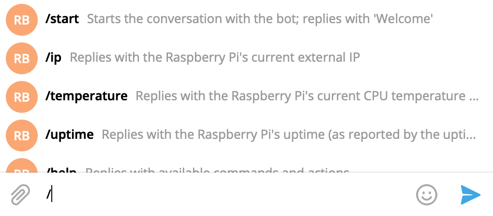

# Raspberry Pi Telegram Bot

Simple Telegram Bot that can run on a Raspberry Pi and provide some
information/execute some actions.

This bot was created to learn more about the Telegram Bots API
(through the [python-telegram-bot](https://github.com/python-telegram-bot/)
wrapper lib) and interface with my own Raspberry Pi, so I included actions
and information useful to me, but it should be easy to extend it with more
stuff according to your needs.

## Development

This bot is developed using Python 3. To start running it, first create a
new virtual environment:

    python3 -m venv ENV

Then activate it:

    source ENV/bin/activate

And install the requirements:

    pip install -r requirements.txt

You also need to register a bot with BotFather, as shown
[here](https://core.telegram.org/bots#creating-a-new-bot), and take note of the
token BotFather gives you; this token will be provided to the bot's configuration
so that the bot can connect with Telegram.

The bot can then be run with:

    python bot.py

## Commands and interactions

The following commands/interactions are available:

* `/start`: Replies with 'Welcome' for now
* `/ip`: Replies with the Raspberry Pi's current external IP
* `/temperature`: Replies with the Raspberry Pi's current CPU temperature
(as reported by the `vcgencmd measure_temp` command), in celsius
* `/uptime`: Replies with the Raspberry Pi's uptime (as reported by the `uptime`
command)
* `/help`: Replies with available commands and actions
* Sending an image (as a photo) saves it at a subdirectory of the
`images_dlna_basepath` [setting](#settings) named after the current date
(in `%Y-%m-%d` strftime format), with the filename `image.jpg` (or `image_1`,
`image_2` etc. depending on how many images have already been saved at this path).
If `images_dlna_basepath` is not set, images will not be saved. The bot will also
reply confirming that the image was received and saved (unless there's any error,
in which case its info will be available at the logs only)
* Sending an image as a file results in the same as sending it as a photo, the
only difference being that its original extension is used in the filename

Unknown commands will prompt a reply alerting that the commands is unknown and
directing to the `/help` command. Regular text messages will prompt a reply
alerting that the bot does not reply to them and directing to the `/help`
command after every `max_text_warning` (see the setting [below](#settings))
messages. Attachments that are not images will be ignored.

### Command information/suggestion

In order to get command information/suggestion as you type, such as in the
screenshot above, you must provide this information to BotFather after having
registered the bot.

To do this, go to the chat with BotFather, use the `/setcommands` command,
choose your bot and then reply with the commands and respective information
in the specified format. To make this easier, you can copy the contents of
the [command_descriptions](command_descriptions.txt) file, as it already
contains the commands and information in the correct format.

## Settings

Most of the behavior and actions of the bot can be configured by using the
`settings.json` file. The project contains a `settings_default.json` with
default values, but expects a `setting.json` with the real settings; it will
alert the user and exit if there is none such file. The `settings.json` can be
easily created by either renaming or copying the `settings_default.json` file
and modifying the configuration as needed.

The properties that can be edited and their meanings/accepted values are:

* `token`: A string with the Telegram API Token provided by BotFather when your
bot was first registered; the default is empty but the bot will not function
without a valid value for this property
* `whitelist`: List with the user IDs of the users that the bot will respond to.
One way to get a user ID is by messaging [`userinfobot`](https://t.me/userinfobot);
you can also use the `python-telegram-bot` API itself and get it from the `User`
object available at `update.message.from_user`. The default is a list with the
`-1` value (an invalid ID) but there will be a warning if used like that as all
messages would be ignored. The list should not be empty; if you really want the
bot not to reply to anyone, keep the default or use similar invalid IDs such as
`0`
* `ip_changes`: List with the user IDs of users that will be notified when the
Raspberry Pi's **external** IP changes. The default is an empty lisy
* `restarts`: List with the user IDs of users that may be notified when the bot
[re]starts. The default is an empty list
* `max_text_warning`: Number of regular text messages after which the bot will
reply with a warning stating that it does not reply to these messages and
pointing to the `/help` command. Defaults to `3`
* `connection`: Object with the following connection-related properties:
    * `max_retries`: Maximum number of times the bot will retry its initialization
    process. The default is `300`
    * `retry_timeout`: Number of seconds the bot will wait between retries of its
    initialization process. The default is `60` seconds (one minute)
    * `ip_check_interval`: Number of seconds between external IP checks to see if
    it has changed. The default is `3600` seconds (one hour)
    * `uptime_threshold`: Threshold (in seconds) to determine whether the bot will
    alert of a [re]start or not. If the current uptime of the Raspberry Pi is less
    than or equal to this number, alerts will be sent. The default is `600` seconds
    (10 minutes)
* `logging`: Object with the following logging-related properties:
    * `log_file`: Absolute path of the file where the log should be saved; note
    that certain locations (such as the default `/var/log/rpi-telegram.log`) will
    require that the bot be run by a root user
    * `max_backups`: Number of old logs that will be backed up (when the log is
    rotated and this number has already been reached, the oldest will be replaced
    and so forth). The default is `10`
    * `file_max_bytes`: Maximum size in bytes that a log file can reach before
    being rotated. The default is `10485760` bytes (10MB)
* `images_dlna_basepath`: Absolute path to the directory where images should be
saved in order to be served by a DNLA server. Note that even if there is no DLNA
server in the Raspberry Pi, the images will still be saved. The path must not be
empty, and the default is `/home/pi/minidlna/`

## Running the bot continuosly

Even though the bot can be manually run as explained in the
[Development](#development) section, most of the times it is preferrable to start
it automatically in some other way and ensure it restarts when the Raspberry Pi
[re]boots.

There are different ways to make a program run automatically on the Raspberry Pi
at startup, as described in
[this tutorial](https://learn.sparkfun.com/tutorials/how-to-run-a-raspberry-pi-program-on-startup).

For this bot, if using the `rc.local` method, you might add a command such as:

    sudo bash -c 'cd /home/pi/Developer/raspberry-pi-telegram-bot && source ENV/bin/activate && python bot.py > /var/log/rpi-telegram-bot-startup.log 2>&1' &

With the path `home/pi/Developer/raspberry-pi-telegram-bot` modified according to
the path the project was cloned to. Also, the
`/var/log/rpi-telegram-bot-startup.log`, where the log of the bot startup (the
command execution actually) will be saved, may be modified too according to your
preferences.

If using the `systemd` method, you can copy the provided
`raspberry-pi-telegram-bot.service` file to `/lib/systemd/system/` and modify the
`WorkingDirectory` and `ExecStart` entries to point to the correct path for your
system.

## Contributing

If you have any bugs, improvements or ideas to report, feel free to create issues
and/or pull requests or forks and I will try to reply/review as soon as I can!

## TODO List

Possible features/ideas:
* [ ] Tests
* [ ] Allow user to choose between Portuguese and English replies
* [ ] Allow user to send/save videos, not only images
* [ ] Create command to display latest logs
